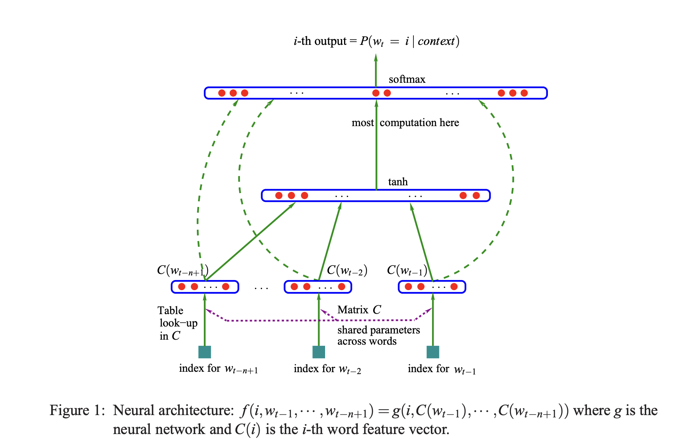

### Modeling Word Distribution

In the bigram model, we aim to model the conditional probability distribution of \( P(w_2 | w_1 = x) \). This represents the likelihood of the next character \( w_2 \) given the current character \( w_1 \).

### Parameter Estimation

- **Number of Parameters**:
  - In this model, \( w_1 \) can take on **27 possible values** (26 letters + start/end token).
  - For each \( w_1 \), \( w_2 \) can also take **27 possible values**.
  - Therefore, the total number of parameters to learn is:
    \[
    27 \times 27 = 729
    \]
  - These parameters are learned using a **weight matrix** in a simple **single-layer neural network**.

### Extending to Trigram Model

Now consider a scenario where the next character depends not only on the previous character \( w_1 \), but also on the character before that, \( w_0 \). In this case, the distribution becomes \( P(w_2 | w_1, w_0) \).

- **Number of Parameters**:
  - \( w_0 \) can take **27 values**.
  - \( w_1 \) can take **27 values**.
  - \( w_2 \) can take **27 values**.
  - The total number of parameters required is:
    \[
    27 \times 27 \times 27 = 19,683
    \]

### Key Takeaway

- **Bigram Model**: Requires **729 parameters**.
- **Trigram Model**: Requires **19,683 parameters**, which is significantly larger.

This highlights the exponential growth in the number of parameters as we increase the dependency on previous characters. Learning such a large number of parameters can be computationally expensive and data-intensive.

to get ride of the exponential growth in the number of parameters, we will be implementing MLP approach implemented in the "A Neural Probalilistic Language Model" paper. 
